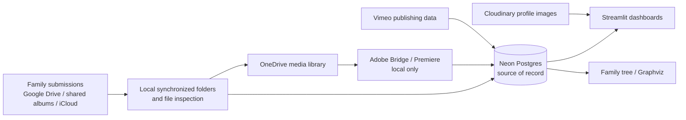

# Year End architecture

## Purpose and boundaries

Year End manages family media submitted for annual and occasional long-form
reviews, records the media and editorial state in Neon Postgres, produces
Streamlit dashboards, and supports relationship-aware family-tree work.

For the human and recurring production process that this code supports, see the
[operational workflow](WORKFLOW.md).

The repository currently combines cloud-backed storage with local filesystem
and Adobe workflows. The intended direction is cloud-first for storage and
database operations; Adobe Bridge and Premiere remain local-only.

## Runtime surfaces

| Surface | Entrypoint | Responsibility | Execution context |
| --- | --- | --- | --- |
| Media lifecycle CLI | `main.py` | Copy, inspect, deduplicate, purge, and summarize submitted media; update profile images. | Primarily local today. |
| Premiere/audio CLI | `compile.py` | Prepare review projects, import rated clips, set labels, record appearances/chapters, and obtain music/captions. | Local-only; depends on Adobe/Premiere and local files. |
| Streamlit app | `display.py`, `pages/` | Family-facing dashboard home, YIR status, growth, timeline, and the future relationship explorer. | Cloud-capable; authentication is a future requirement. |
| Tree exploration | `tree.py` | Exploratory developer script for inspecting relationships and resolving Graphviz layout issues; not a long-term CLI. | Local/developer tool. |
| Provider checks | `tests/integration/check_onedrive.py`, `tests/integration/check_google_drive.py` | Explicit OAuth and read-only connectivity checks. | Local OAuth bootstrap. |
| Local scratch | `test.py` | Ignored, disposable database checks. | Local only. |

## High-level data flow

This diagram describes the current local-first path. The Google Drive and
OneDrive API clients under `integrations/` are the first pieces of the planned
cloud-first replacement for synchronized-folder operations.

## Packages and ownership

### `common/`

Shared system and configuration support.

- `structure.py` reads TOML configuration and derives locations, app paths,
  media constants, provider endpoints, and local token-cache paths.
- `locations.py` detects OneDrive, mounted Google Drive, external drives,
  applications, browsers, and OS-specific paths for Windows and macOS.
- `system.py` supplies filesystem traversal, file classification, cloud-file
  availability checks, shortcut resolution, and local application launching.
- `secret.py` loads the local secret configuration; consumers should read from
  it without exposing values.
- `console.py` provides the multi-part CLI status/output surface.

### `database/`

Database access is organized by domain over a shared SQLAlchemy/psycopg engine.

- `db.py` creates engines and provides the shared `read_sql`, `execute_sql`, and
  DataFrame-to-parameter helpers.
- `db_project.py` owns project media folders/files, source albums, media types,
  duplicate summaries, and yearly summaries.
- `db_adobe.py` owns Premiere labels, appearances, chapters, compilation
  settings, and music/review queries.
- `db_display.py` supplies display-name, household/clan, and enum data for
  dashboards.
- `db_family.py` supplies people, animals, parents, pets, marriages/spouses,
  memberships, households, and founder data for tree traversal.

The code refers to schemas including `project`, `config`, `ingestion`, `tree`,
`publishing`, and `nello`. Actual table/view definitions live in Neon rather
than this repository. See [the schema guide](SCHEMA.md) for the documented
application-facing inventory; schema changes still require an explicit impact
audit.

### `repositories/`

Application orchestration around database records and media workflows.

- `iterate.py` derives storage locations for configured media types.
- `migrate.py` copies Google Drive media to OneDrive, identifies likely
  duplicates, and moves duplicates to quarantine.
- `ingest.py` downloads supported shared albums through the scraping package.
- `inspect.py` reconciles the local media tree with project records, extracts
  metadata, records files/folders, detects Premiere usage, and provisions
  default Cloudinary profile images.
- `assemble.py` prepares Premiere projects, imports usable clips, applies labels,
  and writes appearance/chapter information back to Neon.
- `listen.py` obtains audio and caption data for review music.

### `adobe/`

Local-only media and desktop application helpers.

- `bridge.py` extracts Bridge/XMP ratings and video metadata. It uses Hachoir
  and OpenCV, returns safe sentinel information for unavailable/corrupt media,
  and should be treated as requiring a local file.
- `premiere.py` controls Premiere through Pymiere, reads `.prproj` XML content,
  and manages import, bins, labels, appearances, and markers.
- `audition.py` downloads audio and produces SRT captions from YouTube/caption
  or lyric sources.

### `integrations/`

Provider-specific API packages. Each integration owns its own authentication
and client modules.

- `onedrive/` performs delegated Microsoft OAuth, refreshes cached tokens, and
  makes read-first Microsoft Graph calls. It can inspect the current drive and
  resolve a sharing URL to a canonical item.
- `google_drive/` performs desktop OAuth with PKCE, refreshes cached tokens, and
  lists root-level Drive items through Drive API v3.

Both integrations use credentials from the local secrets mechanism and store
renewable local tokens under `.secrets/auths/tokens/<provider>/token.json`.
The existing clients are intentionally read-first; write/move/delete operations
remain future work and must use the external-action safeguards in `AGENTS.md`.
They currently use only the Python standard library and therefore add no
requirements-file dependency.

### `scraping/`

Browser-driven import of shared Google Photos and iCloud albums. `main.py`
currently invokes this route for `--gphotos` and `--iphotos`; it uses Selenium
and locally available browser profiles. Google Photos is not a current
cloud-migration target.

### `charting/` and `pages/`

Streamlit presentation layer.

- `charting/general.py` defines sidebar navigation and chart rendering.
- `charting/charts.py` builds Altair submission, review, growth, and timeline
  visualizations, including Cloudinary profile imagery.
- `pages/yir_count.py` shows a selected year's submission/review status.
- `pages/yir_growth.py` shows trends across projects/years.
- `pages/yir_time.py` combines relationship data with Premiere appearance spans
  and chapter markers to show representation through a review timeline.

### `family_tree/`

Relationship traversal and rendering work built on the same Neon family data.

- `ancestry.py` constructs parent/pet/spouse maps, identifies relatives from a
  configured founder, and filters tree membership by animal, date, entry, and
  deceased status.
- `tree_maker.py` is the experimental Graphviz renderer for the desired visual
  family-tree layout. Its relationship traversal is a foundation for the future
  Streamlit explorer; visual legibility is the principal remaining issue.
- `cloudinary_lite.py` constructs public profile-image URLs for dashboards and
  tree output.
- `cloudinary_heavy.py` uses Cloudinary management APIs to create or update
  profile-image assets and metadata.

### `playback/`

`vimeo.py` fetches the authenticated user's Vimeo videos and derives publishing
statistics for review folders. It is a narrow initial integration and a planned
expansion area.

## Current media lifecycle

1. `main.py` obtains configured media types from Neon.
2. Local Google Drive folders may be copied into local OneDrive folders, with
   quarantine used for candidate duplicates.
3. Shared photo albums may be downloaded through Selenium-based ingestion.
4. Local OneDrive folders are reconciled with `project.folders` and
   `project.files`: stale records may be purged and discovered files/folders may
   be inserted or updated.
5. Available local media receives ratings, date, duration, and resolution
   inspection; cloud-only placeholders retain only data that can be read without
   downloading them.
6. The Premiere workflow uses reviewed media and writes usage/appearance data
   back to Neon. Streamlit then reads database summaries and relationship data.

## Configuration and dependency model

- `config/config.toml`, `config/api.toml`, and `config/drives.toml` hold
  non-secret, environment-aware configuration.
- `.secrets/secrets.toml` supports the local CLI and expanded integrations;
  `.streamlit/secrets.toml` holds the narrower Streamlit deployment set.
- `requirements.txt` is the Streamlit/cloud baseline.
- `requirements_full.txt` includes the local media, desktop, and scraping
  dependencies in addition to the baseline.
- `tests/integration/` contains reusable, manual OAuth connectivity checks. Run
  them as modules (for example, `python -m tests.integration.check_onedrive`)
  so the repository root remains importable.
- The standard project runtime is the Python 3.14 `.venv`. The requirements file
  retains a distutils compatibility shim for Pymiere on Python 3.12+.

## Local versus cloud boundary

| Capability | Current state | Target direction |
| --- | --- | --- |
| Database reads/writes | Neon via SQLAlchemy | Cloud-capable now; schema/API work remains. |
| OneDrive inventory/share resolution | Microsoft Graph client | Extend to safe cloud operations. |
| Google Drive inventory | Drive API client | Extend to safe cloud operations. |
| Google Drive to OneDrive copy | Local synchronized folders | Design a provider-to-provider transfer strategy. |
| Video metadata extraction | Local OpenCV/Hachoir | Use remote metadata where available; download only when needed. |
| Shared album ingestion | Selenium/local browsers | Reassess provider-supported cloud paths. |
| Adobe Bridge/Premiere | Local desktop applications | Keep local-only. |
| Streamlit dashboards | Streamlit + Neon + Cloudinary | Cloud-capable; improve UX and Vimeo integration. |

## Intended execution surfaces

The target architecture combines three complementary surfaces rather than
forcing every operation into one hosted application:

| Surface | Intended use | Boundary |
| --- | --- | --- |
| Authenticated Streamlit | Family-facing data visualizations, including the family tree, and a possible first administrative UI. | Read access and administrative roles must be distinct before broader family access. |
| GitHub Actions | Scheduled or manually triggered cloud-native ingestion, cleanup, inventory, and reporting jobs. | Jobs use repository/environment secrets and must not attempt local browser-profile or Adobe work. `workflow_dispatch` can provide controlled manual inputs. |
| Local worker | Selenium/browser-profile collection and Adobe Bridge/Premiere operations. | A cloud service may queue or report this work, but cannot migrate the trusted local profiles or desktop applications. |

An administrative GUI for actions such as adding a person or changing a profile
photo needs an authenticated server-side write boundary. It may begin as a
role-restricted Streamlit area. A GitHub Pages site could later provide a static
front end, but it would need to call a separate authenticated API; it must never
connect directly to Neon or expose provider credentials in browser code.

## Questions for review

- Which Neon views are contractual interfaces for the application and must be
  documented before database modernization?
- Which entities distinguish family members, friends, contributors, and
  tree-visible members today? The tree filters by membership/relationship data,
  but the intended product rule should be named explicitly.
- Which Vimeo operations are already used outside `playback/vimeo.py`, and which
  future actions are desired (inventory, upload, folders, publishing, stats)?
- Should provider token storage remain strictly local for desktop OAuth, with a
  distinct credential strategy for hosted automation?

## Follow-up observations

- Several existing modules lack the module/function documentation standard now
  recorded in `AGENTS.md`. Improve documentation incrementally as those modules
  are changed rather than performing a mechanical rewrite.
