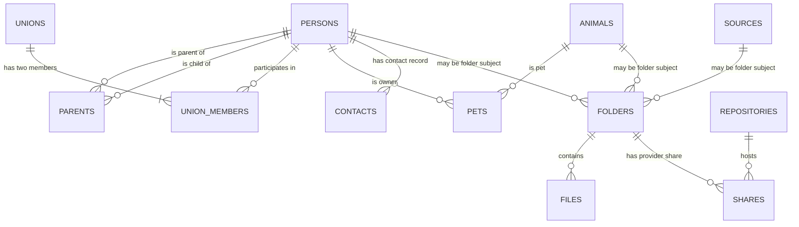

# FamilyTree database schema

## Purpose and scope

This document is a curated map of the Neon Postgres database used by Year End
and the family-tree work. It records database structure and application-facing
relationships, not family records, credentials, tokens, or database exports.

The inventory was verified against the primary `main` branch on 2026-09-02 via
the connected Neon Postgres integration. It is intentionally not a raw DDL
dump: migrations and database changes must update this document when they alter
an application-facing contract.

## Ownership and internal schemas

| Schema | Role | Documentation scope |
| --- | --- | --- |
| `public` | Core people, animals, and direct relationship records. | Documented here. |
| `tree` | Relationship-derived views used for family membership and tree traversal. | Documented here. |
| `project` | Year-in-Review folders, files, sources, shares, appearances, and summaries. | Documented here. |
| `dashboard` | Read-only application views and functions backed by the authoritative family/project data. | Documented here. |
| `demo` | Synthetic tables matching the public Streamlit data contract without exposing family data. | Documented at a domain level. |
| `config` | Media and Adobe/project reference data. | Documented at a domain level. |
| `ingestion` | Submission-source, browser, repository, album, and contact metadata. | Documented at a domain level. |
| `publishing` | Reviews and their music/publishing metadata. | Documented at a domain level. |
| `nello` | Project-level family configuration, currently including the configured founder. | Documented at a domain level. |
| `auth` | Application/session helper functions. | Internal; not a public data contract. |
| `neon_auth` | Neon-managed authentication synchronization. | Platform-managed; do not modify casually. |
| `_debugging` | Dependency/debugging views. | Internal tooling. |

## Core relationship model

`tree` views derive family-specific membership and relationship structures from
the core records. A person being present in `public.persons` does not by itself
mean they should appear in a family-tree presentation; tree-facing code should
use the appropriate `tree` view/membership rules.

## `public`: people and direct relationships

### Maintainer notes

Free-form `notes` columns in family/core data are maintenance annotations: they
explain historical decisions, anomalies, or follow-up work to the project
maintainer. They are not business data. Application queries, derived views,
automation, and family-facing outputs must not rely on or display them; the
only permitted exposure is an intentionally private `_debugging` or maintenance
surface.

### `persons`

Core person identity record.

| Column group | Fields |
| --- | --- |
| Identity | `person_id` (UUID primary key), `prefix`, `first_name`, `middle_names`, `uses_middle`, `last_name`, `suffix`, `nick_name` |
| Personal data | `sex`, `birth_date`, `birth_date_precision`, `death_date`, `death_date_precision`, `notes` |

Current database checks constrain birth precision to `day`, `month`, `year`,
`past`, or `future`; death precision to `day`, `month`, `year`, or `past`; and
the existing `sex` field to `m` or `f`. These are current physical constraints,
not an endorsement of their suitability for future family modeling.

When `uses_middle` is true, `dashboard.display_names` intentionally appends only
the first semicolon-delimited value from `middle_names` to the displayed given
name. This is a presentation preference used by all consumers of the shared
view, including Calendar event titles.

### `parents`

Relationship table with `child_id`, `parent_id`, and `relation_type`. Current
relation types are `biological`, `adoptive`, and `step`; the default is
`biological`. Semantically, this is already the appropriate many-to-many
junction: a person may have multiple recorded parents and may parent multiple
people.

The current schema inspection exposes only the relation-type `CHECK`, not a
declared composite primary/unique key or foreign keys. A focused integrity
hardening should add uniqueness for `(child_id, parent_id)`, foreign keys to
`persons`, and a self-parent guard. Confirm deletion behavior before selecting
foreign-key actions.

Do not impose a blanket maximum of two rows per child by default. Biological,
adoptive, and step relationships can legitimately coexist, and a hard limit
would make the stored record less truthful. If a future tree visualization
needs to show only two primary parent edges, model that as an explicit display
selection/rule rather than discarding additional relationship data. A deferred
trigger could enforce a maximum of two only if that restricted data policy is
deliberately chosen.

### `unions` and `union_members`

`unions` is the provider-neutral pair-relationship record. It has `union_id`,
`union_date`, `union_date_precision`, `union_type`, `last_name_person_id`, and
`last_name_hyphen`. Current union types are `marriage`, `civil`, and `friends`.
The optional last-name fields describe presentation behavior without assigning
sex-specific partner roles.

`union_members` links each union to its people through `person_id` and
`union_id`. Its composite primary key is `(person_id, union_id)`, both columns
have foreign keys to their parent records, and a deferred constraint trigger
enforces the cross-row membership limit at transaction commit. Code that
creates a union must create the union and both memberships in one transaction.

Consumers should use `tree.partnerships` for one row per marriage or civil
union, `tree.partners` for directional partner traversal, and the corresponding
friend views for friendship relationships. They must not infer identity or
roles from partner order.

### `animals` and `pets`

`animals` holds animal identity records. `pets` connects `pet_id` to `owner_id`
and stores `relation_type`, `gotcha_date`, and date precision. Current pet
relation types are `adoptive` and `shared`. It already supports multiple owners
per animal and multiple animals per person, so it needs no structural redesign.

As with `parents`, the current inspection exposes only its `CHECK` constraints,
not a declared composite primary/unique key or foreign keys. A focused
integrity hardening should add uniqueness for `(pet_id, owner_id)` and foreign
keys to `animals` and `persons`, after confirming deletion behavior. Whether a
`gotcha_date` belongs to the animal itself or an owner-specific relationship is
a semantic question for a later review, not a reason to change its cardinality.

### Other `public` objects

- `founder_id`, `generation_to_text`, and `suffix_to_text` are helper
  functions used by the relationship/display layer.

## `tree`: derived family structure

`tree` contains views rather than separate, disconnected copies of family data:

- `members`: family/tree membership attributes, dates, member type, and related
  data used by `family_tree.ancestry`.
- `partnerships`: one row per `marriage` or `civil` union, with
  `partner_id_1`, `partner_id_2`, union date/precision, and union type.
- `partners`: directional partner projection with `person_id`, `spouse_id`,
  `union_id`, and union type, used by relationship traversal.
- `friendships` and `friends`: corresponding pairwise and directional
  projections for `friends` unions.
- `households` and `clans`: current and birth/household grouping for display and
  representation logic.
- `heads`, `apexes`, and `nodes`: derived structural views used by tree layout
  and relationship calculations.

These views are part of the effective application contract. Before changing
core relationship tables, inspect their definitions and consumers.

The current `tree` view definitions have no direct reference to the configured
founder. Founder selection remains outside this schema, allowing tree structure
to remain relationship-agnostic; trace indirect helper/view dependencies before
changing the `nello.founder` configuration.

## `dashboard` and `demo`: application-facing data contract

Streamlit reads application-facing relations from either `dashboard` or `demo`.
The `dashboard` schema contains views over authoritative records; `demo`
contains synthetic tables with the matching columns needed for public pages.
Public application code must not combine the two schemas in one request.

- `display_names` provides presentation-only member names.
- `founder` exposes the configured family root without moving that configuration
  out of `nello`.
- `member_information` combines display names, current and prior clans,
  clan-effective dates, member dates/types, and `is_clan_1_head`. Every member
  has a current `clan_id_1`; `clan_id_2` is optional and represents a clan from
  which the member came. A member cannot be a head of `clan_id_2`.
- `folders_summary`, `years_summary`, `resolution_order`, and
  `appearance_spans` provide chart-ready Year-in-Review data.
- `relations_summary` provides display-oriented relationship descriptions.
- `_family_members_old(start_member_id, cut_date, traversal_mode,
  include_partner_branches)` returns every dashboard member once. Related
  members receive a calculated generation and traversal metadata; unrelated
  members receive `NULL`. Supported traversal modes are `up`, `down`,
  `up_down`, and `bidirectional`. An omitted or `NULL` cutoff date uses the
  database server's `CURRENT_DATE`.
- `family_members` exposes the same traversal modes using direct parent,
  pet-owner, and dated marriage/civil-union edges. It additionally identifies
  the relationship type and whether the selected path entered through a
  non-opening partner. Member birth dates, pet gotcha dates, and union dates
  determine whether nodes and edges existed at the requested cutoff. Parent
  rows have no relationship date, so the child entry date is their only
  historical boundary. This function is intentionally parallel to the clan
  implementation while their results are evaluated. It uses the same cutoff
  default as `_family_members_old`.
- The preferred `family_members` also classifies each member's parent/owner
  node from the complete sorted set of parent or owner UUIDs. It returns a
  deterministic `parent_node_key`, node type, head IDs, nodes headed by the
  member, sibling order, and integer-array `lineage`. One-head nodes are
  `solo`, two-head nodes are `pair`, and larger sets are reported as `multiple`
  rather than silently truncated. The canonical key can later be converted to
  UUIDv5 without changing unit membership. Its integer-array `ancestry` records
  the opening-member branch followed by each stable parent position during
  upward traversal; opening members and descendants retain an empty array.

The reproducible definitions and rollback commands currently live in
`database/dashboard_family_members.sql` for `_family_members_old` and
`database/dashboard_family_members_2.sql` for the preferred `family_members`.

## `project`: media and Year-in-Review state

`project` describes the canonical OneDrive media library only. Google Drive,
Google Photos, iCloud, email, and other sources feed material into that library
but are not alternate project-file inventories; their source metadata belongs
in ingestion-oriented structures. Project folder summaries, duplicate analysis,
and editorial views rely on this single-repository boundary.

### `folders`

Represents a project-year media folder.

| Column group | Fields |
| --- | --- |
| Identity | `folder_id` (UUID primary key), `folder_name`, `project_year`, `media_type` |
| Optional subject/source links | `person_id`, `animal_id`, `source_id`, `member_id` |

The database allows at most one non-null value among `person_id`, `animal_id`,
and `source_id`. `(project_year, media_type, folder_name)` is unique with nulls
treated as equal. `media_type` references `config.media`.

`member_id` is generated as `COALESCE(person_id, animal_id, source_id)`; clients
set the appropriate typed owner column and must not assign `member_id` directly.

The optional person/animal/source link identifies the folder's project/editorial
subject, not necessarily the literal uploader. For example, an animal-linked
folder can hold scenes filmed by a person but organized separately so those
clips do not inflate that person's general submission count.

Provider storage identities are normalized through `folder_locations`, rather
than stored as vendor-branded columns on the folder. A location links a folder
to an `ingestion.repositories` record, stores the provider's opaque
`repository_item_id`, and records whether that location is canonical. OneDrive
is currently canonical; Google Drive is a source location. The provider item ID
is the durable lookup key for inventory and moves and is not inferred from a
path or share URL.

### `files`

Represents a discovered media file within a project folder.

| Column group | Fields |
| --- | --- |
| Identity/location | `file_id`, `folder_id`, `file_name`, `subfolder_name`, `base_name`, `file_extension` |
| File/editorial metadata | `file_size`, `video_date`, `video_duration`, `video_resolution`, `video_rating`, `used_status` |

`folder_id` references `project.folders` with cascade deletion. The unique file
identity is `(folder_id, file_name, subfolder_name)`, with nulls treated as
equal. Ratings are constrained to 0 through 5.

Numeric media metadata uses the following application-level units. These units
are not encoded in the current database column names or types, so consumers
must preserve them explicitly:

| Field | Stored unit or representation | Producing code |
| --- | --- | --- |
| `file_size` | Mebibytes (MiB), rounded to one decimal place (`bytes / 1024^2`) | `repositories/inspect.py` and `repositories/cloud_inspect.py` |
| `video_duration` | Whole seconds | Local inspection or Microsoft Graph metadata through `repositories/cloud_inspect.py` |
| `video_resolution` | Text category from `common.video.get_resolution`; not a pixel count | Local inspection or Microsoft Graph metadata |
| `video_rating` | Integer rating from 0 through 5 | `repositories/inspect.py` |

Aggregate `file_size` values in `folders_summary` and `years_summary` retain
MiB. Divide them by 1024 for GiB; labels using decimal MB/GB terminology are
display shorthand and should not be used to infer a different stored unit.

When individual cloud-file operations are introduced, store the corresponding
provider-neutral canonical item ID and repository relationship here as well. It
lets the system inspect, move, or create a share link for a known file without
repeatedly searching storage by name/path.

### Supporting tables and views

- `sources`: named non-person/animal submission sources.
- `folder_locations`: maps a project folder to an `ingestion.repositories`
  provider, its opaque `repository_item_id`, and `is_canonical`. Provider item
  IDs are unique within a repository.
- `shares`: maps a folder location to a share URL and tracks `is_active`,
  optional `expires_at`, and `last_verified_at`. It remains a share capability,
  not the primary item identity: links can be revoked or recreated while the
  provider item ID remains stable. Current-year contribution links are
  upload-capable: anonymous `edit` links in OneDrive and `anyone`/`writer`
  permissions in Google Drive. Historical reconciliation never creates or
  upgrades a missing permission.
- `appearances` and `chapters`: Premiere-derived editorial output.
- `duplicates` and `duplicates_summary`: duplicate-detection views.
- Dashboard-facing folder, year, resolution, and appearance projections are
  exposed through the corresponding `dashboard` views.

Premiere-derived time positions in `appearances` and `chapters` are stored in
seconds. Duration aggregates exposed by the project summary views likewise
retain seconds unless a consuming query or display converts them.

## `ingestion`: submission metadata

- `repositories`: storage/provider repositories.
- `shared_albums` and `shared_album_details`: shared-source data used by the
  Selenium ingestion workflow.
- `scrape_sources`, `browsers`, and `browser_profiles`: local scraping
  configuration.

## `messaging`: contacts and message preparation

- `contacts`: optional `person_id`, `email_address`, and `phone_number` contact
  data. It references `public.persons`. A populated phone number is currently a
  US-only ten-digit text value with no country code, spaces, punctuation, or
  extension.
- `addresses`: reusable address records. The current scaffold stores an optional
  address label and required postal code; fuller address components and final
  uniqueness rules remain to be designed.
- `address_moves`: links a person to an address with an optional start date so
  address history can be represented relationally.
- `no_contacts`: person/year suppression records used to remove people from a
  project's otherwise folder-derived recipient set.
- `templates`: an initial project-year message-template scaffold. Its content,
  versioning, and message-purpose fields still need to be designed before the
  drafting workflow depends on it.
- `calendar_events`: maps exactly one `person_id` birthday or `union_id`
  anniversary to one opaque recurring-master `external_event_id`. Partial
  uniqueness rules permit at most one mapping per person or union, while the
  external ID is also unique. Event titles, dates, and recurrence rules remain
  live derivations from the family record rather than duplicated state.

The contact model is intentionally small today. A current phone number can be a
simple nullable contact field if one current value per person remains the
product rule. Historical addresses are better represented by an address record
plus a person/address relationship with optional date range, rather than JSONB,
if mapping or residence-history queries are desired. Historical email addresses
need a distinct decision: retain the current reachable email as contact data,
but preserve past inbox sender addresses in a separate archive/source identity
model if email discovery needs to recognize them. Do not silently promote every
historical sender address into a current contact method.

## `config`: reference and workflow settings

- `media`: configured media types and source-folder mapping.
- `compilations`: review/Premiere compilation settings.
- `member_labels`, `adobe_labels`, and `color_palette`: label and color
  configuration used by the Adobe workflow.

## `publishing` and `nello`

- `publishing.reviews`: year/decade review identity and publishing metadata,
  including theme, duration, resolution, cloud URL, and public date. Review
  duration is stored in seconds.
- `publishing.music`: music associated with reviews. Track duration is stored
  in seconds.
- `nello.founder`: configured root/founder for family-tree traversal.

## Application consumers

| Consumer | Primary database surface |
| --- | --- |
| `repositories/inspect.py`, `repositories/migrate.py` | `project` tables/views and `config.media` |
| `repositories/assemble.py`, `compile.py` | `project`, `config`, and `publishing` |
| `scraping/`, `repositories/ingest.py` | `ingestion` source and album views |
| Streamlit `pages/` | The selected `dashboard` or `demo` application contract; remaining direct operational-table reads are being retired |
| `family_tree/` | `public` relationship tables plus `tree` membership, household, and partner views |
| Future onboarding/reference API | `public`, `tree`, and `messaging`; must use scoped access controls |

## Documentation and migration rules

1. Treat primary keys, foreign keys, unique constraints, check constraints, and
   application-facing views as contracts.
2. Before a schema migration, document affected views, Python consumers, data
   backfill, validation query, rollback path, and privacy impact.
3. Update this document with the final schema decision—not speculative design—
   in the same change as an application-facing migration.
4. Do not document values from private family records in this repository.

## Questions for review

- What is the intended distinction among `person_id`, `animal_id`, `source_id`,
  and `member_id` on `project.folders`?
- Which `tree` views should be considered stable interfaces versus work in
  progress?
- Should `messaging.contacts` remain one current email and phone per person, or
  eventually support multiple typed contact methods and history?
- Should `project.folder_locations` enforce one current location per folder and
  repository, or deliberately retain multiple historical locations?
- Should unions eventually represent end dates or statuses such as separation,
  divorce, or dissolution, and how should those affect tree and Calendar views?
