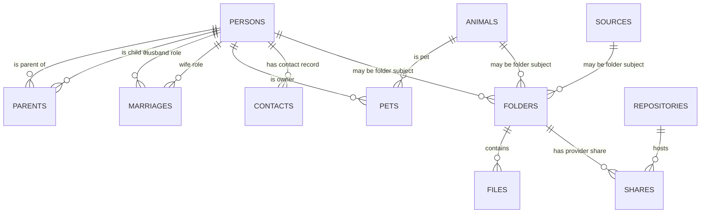

# FamilyTree database schema

## Purpose and scope

This document is a curated map of the Neon Postgres database used by Year End
and the family-tree work. It records database structure and application-facing
relationships, not family records, credentials, tokens, or database exports.

The inventory was verified against the primary `main` branch on 2026-08-15 via
the connected Neon Postgres integration. It is intentionally not a raw DDL
dump: migrations and database changes must update this document when they alter
an application-facing contract.

## Ownership and internal schemas

| Schema | Role | Documentation scope |
| --- | --- | --- |
| `public` | Core people, animals, and direct relationship records. | Documented here. |
| `tree` | Relationship-derived views used for family membership and tree traversal. | Documented here. |
| `project` | Year-in-Review folders, files, sources, shares, appearances, and summaries. | Documented here. |
| `config` | Media and Adobe/project reference data. | Documented at a domain level. |
| `ingestion` | Submission-source, browser, repository, album, and contact metadata. | Documented at a domain level. |
| `publishing` | Reviews and their music/publishing metadata. | Documented at a domain level. |
| `nello` | Project-level family configuration, currently including the configured founder. | Documented at a domain level. |
| `auth` | Application/session helper functions. | Internal; not a public data contract. |
| `neon_auth` | Neon-managed authentication synchronization. | Platform-managed; do not modify casually. |
| `_debugging` | Dependency/debugging views. | Internal tooling. |

## Core relationship model

`tree` views derive family-specific membership and relationship structures from
the core records. A person being present in `public.persons` does not by itself
mean they should appear in a family-tree presentation; tree-facing code should
use the appropriate `tree` view/membership rules.

## `public`: people and direct relationships

### Maintainer notes

Free-form `notes` columns in family/core data are maintenance annotations: they
explain historical decisions, anomalies, or follow-up work to the project
maintainer. They are not business data. Application queries, derived views,
automation, and family-facing outputs must not rely on or display them; the
only permitted exposure is an intentionally private `_debugging` or maintenance
surface.

### `persons`

Core person identity record.

| Column group | Fields |
| --- | --- |
| Identity | `person_id` (UUID primary key), `prefix`, `first_name`, `middle_names`, `last_name`, `suffix`, `nick_name` |
| Personal data | `sex`, `birth_date`, `birth_date_precision`, `death_date`, `death_date_precision`, `notes` |

Current database checks constrain birth precision to `day`, `month`, `year`,
`past`, or `future`; death precision to `day`, `month`, `year`, or `past`; and
the existing `sex` field to `m` or `f`. These are current physical constraints,
not an endorsement of their suitability for future family modeling.

### `parents`

Relationship table with `child_id`, `parent_id`, and `relation_type`. Current
relation types are `biological`, `adoptive`, and `step`; the default is
`biological`. Semantically, this is already the appropriate many-to-many
junction: a person may have multiple recorded parents and may parent multiple
people.

The current schema inspection exposes only the relation-type `CHECK`, not a
declared composite primary/unique key or foreign keys. A focused integrity
hardening should add uniqueness for `(child_id, parent_id)`, foreign keys to
`persons`, and a self-parent guard. Confirm deletion behavior before selecting
foreign-key actions.

Do not impose a blanket maximum of two rows per child by default. Biological,
adoptive, and step relationships can legitimately coexist, and a hard limit
would make the stored record less truthful. If a future tree visualization
needs to show only two primary parent edges, model that as an explicit display
selection/rule rather than discarding additional relationship data. A deferred
trigger could enforce a maximum of two only if that restricted data policy is
deliberately chosen.

### `marriages`

Marriage record with `marriage_id`, `husband_id`, `wife_id`, `wedding_date`,
and `wedding_date_precision`. The current schema encodes spouse roles in column
names and has a primary key on `marriage_id`.

This is a known database-modernization candidate. A future model could use a
`unions` record (`union_id`, type, start/end dates, and date precision) with a
`union_participants` junction table linking exactly two `person_id` values to
each union. That makes partner order/sex irrelevant, supports a broader set of
pair relationships, and makes a marriage-only spouse view a simple derived
interface.

The junction table needs a composite primary key on `(union_id, person_id)` to
prevent duplicate participants. The "exactly two" cardinality is a cross-row
rule and cannot be safely expressed with a normal `CHECK`; enforce it with a
deferred constraint trigger that validates affected unions at transaction
commit, including a newly created union with zero participants. Creation and
migration must insert the union and both participants in one transaction.

Do not alter the existing model without a migration plan for the
`tree.marrieds` view and every dependent consumer, a parallel derived-view
comparison, and validation of the end-date/relationship-type semantics.

### `animals` and `pets`

`animals` holds animal identity records. `pets` connects `pet_id` to `owner_id`
and stores `relation_type`, `gotcha_date`, and date precision. Current pet
relation types are `adoptive` and `shared`. It already supports multiple owners
per animal and multiple animals per person, so it needs no structural redesign.

As with `parents`, the current inspection exposes only its `CHECK` constraints,
not a declared composite primary/unique key or foreign keys. A focused
integrity hardening should add uniqueness for `(pet_id, owner_id)` and foreign
keys to `animals` and `persons`, after confirming deletion behavior. Whether a
`gotcha_date` belongs to the animal itself or an owner-specific relationship is
a semantic question for a later review, not a reason to change its cardinality.

### Other `public` objects

- `friendships` records person-to-person friendship relationships. It currently
  contains zero rows. Its nullable ordered pair is a less normalized predecessor
  of the proposed `unions`/`union_participants` model; if pairwise friendship
  becomes a union type, retire it only after a full database dependency audit.
- `display_names` is the display-facing view used by dashboards and profile
  image workflows.
- `founder_id`, `generation_to_text`, and `suffix_to_text` are helper
  functions used by the relationship/display layer.

## `tree`: derived family structure

`tree` contains views rather than separate, disconnected copies of family data:

- `members`: family/tree membership attributes, dates, member type, and related
  data used by `family_tree.ancestry`.
- `marrieds`: spouse-pair projection used by relationship traversal.
- `households` and `clans`: current and birth/household grouping for display and
  representation logic.
- `heads`, `apexes`, and `nodes`: derived structural views used by tree layout
  and relationship calculations.

These views are part of the effective application contract. Before changing
core relationship tables, inspect their definitions and consumers.

The current `tree` view definitions have no direct reference to the configured
founder. Founder selection remains outside this schema, allowing tree structure
to remain relationship-agnostic; trace indirect helper/view dependencies before
changing the `nello.founder` configuration.

## `project`: media and Year-in-Review state

`project` describes the canonical OneDrive media library only. Google Drive,
Google Photos, iCloud, email, and other sources feed material into that library
but are not alternate project-file inventories; their source metadata belongs
in ingestion-oriented structures. Project folder summaries, duplicate analysis,
and editorial views rely on this single-repository boundary.

### `folders`

Represents a project-year media folder.

| Column group | Fields |
| --- | --- |
| Identity | `folder_id` (UUID primary key), `folder_name`, `project_year`, `media_type` |
| Optional subject/source links | `person_id`, `animal_id`, `source_id`, `member_id` |

The database allows at most one non-null value among `person_id`, `animal_id`,
and `source_id`. `(project_year, media_type, folder_name)` is unique with nulls
treated as equal. `media_type` references `config.media`.

The optional person/animal/source link identifies the folder's project/editorial
subject, not necessarily the literal uploader. For example, an animal-linked
folder can hold scenes filmed by a person but organized separately so those
clips do not inflate that person's general submission count.

For cloud-native operation, add a provider-neutral canonical storage identity
to the folder record: an opaque provider item ID plus a repository/drive
relationship. OneDrive is the current canonical repository, but those names
must not be baked into the data model. This is the durable lookup key for
inventory and moves; it is not inferred from a path or share URL.

### `files`

Represents a discovered media file within a project folder.

| Column group | Fields |
| --- | --- |
| Identity/location | `file_id`, `folder_id`, `file_name`, `subfolder_name`, `base_name`, `file_extension` |
| File/editorial metadata | `file_size`, `video_date`, `video_duration`, `video_resolution`, `video_rating`, `used_status` |

`folder_id` references `project.folders` with cascade deletion. The unique file
identity is `(folder_id, file_name, subfolder_name)`, with nulls treated as
equal. Ratings are constrained to 0 through 5.

Numeric media metadata uses the following application-level units. These units
are not encoded in the current database column names or types, so consumers
must preserve them explicitly:

| Field | Stored unit or representation | Producing code |
| --- | --- | --- |
| `file_size` | Mebibytes (MiB), rounded to one decimal place (`bytes / 1024^2`) | `repositories/inspect.py` |
| `video_duration` | Whole seconds | `repositories/inspect.py`, via `adobe/bridge.py` |
| `video_resolution` | Text resolution category such as the value returned by `adobe.bridge.get_resolution`; not a pixel count | `repositories/inspect.py`, via `adobe/bridge.py` |
| `video_rating` | Integer rating from 0 through 5 | `repositories/inspect.py` |

Aggregate `file_size` values in `folders_summary` and `years_summary` retain
MiB. Divide them by 1024 for GiB; labels using decimal MB/GB terminology are
display shorthand and should not be used to infer a different stored unit.

When individual cloud-file operations are introduced, store the corresponding
provider-neutral canonical item ID and repository relationship here as well. It
lets the system inspect, move, or create a share link for a known file without
repeatedly searching storage by name/path.

### Supporting tables and views

- `sources`: named non-person/animal submission sources.
- `shares`: maps a folder to an `ingestion.repositories` provider record and a
  share URL; it is the likely persistence point for the future OneDrive sharing
  link workflow. Keep it as a share-pointer/capability record, not the primary
  item-location record: sharing links can be revoked, recreated, or vary by
  audience. Consider extending it to represent the appropriate folder/file
  target and sharing metadata while canonical provider IDs live on the project
  folder/file records.
- `appearances` and `chapters`: Premiere-derived editorial output.
- `duplicates` and `duplicates_summary`: duplicate-detection views.
- `folders_summary` and `years_summary`: dashboard-facing aggregate views.
- `appearance_spans`: timeline-facing appearance view.

Premiere-derived time positions in `appearances` and `chapters` are stored in
seconds. Duration aggregates exposed by the project summary views likewise
retain seconds unless a consuming query or display converts them.

## `ingestion`: submission and contact metadata

- `repositories`: storage/provider repositories.
- `contacts`: optional `person_id`, `email_address`, and `repository_ids` JSONB
  data. It currently references `public.persons`.
- `shared_albums` and `shared_album_details`: shared-source data used by the
  Selenium ingestion workflow.
- `scrape_sources`, `browsers`, and `browser_profiles`: local scraping
  configuration.

The contact model is intentionally small today. A current phone number can be a
simple nullable contact field if one current value per person remains the
product rule. Historical addresses are better represented by an address record
plus a person/address relationship with optional date range, rather than JSONB,
if mapping or residence-history queries are desired. Historical email addresses
need a distinct decision: retain the current reachable email as contact data,
but preserve past inbox sender addresses in a separate archive/source identity
model if email discovery needs to recognize them. Do not silently promote every
historical sender address into a current contact method.

## `config`: reference and workflow settings

- `media`: configured media types and source-folder mapping.
- `compilations`: review/Premiere compilation settings.
- `member_labels`, `adobe_labels`, and `color_palette`: label and color
  configuration used by the Adobe workflow.

## `publishing` and `nello`

- `publishing.reviews`: year/decade review identity and publishing metadata,
  including theme, duration, resolution, cloud URL, and public date. Review
  duration is stored in seconds.
- `publishing.music`: music associated with reviews. Track duration is stored
  in seconds.
- `nello.founder`: configured root/founder for family-tree traversal.

## Application consumers

| Consumer | Primary database surface |
| --- | --- |
| `repositories/inspect.py`, `repositories/migrate.py` | `project` tables/views and `config.media` |
| `repositories/assemble.py`, `compile.py` | `project`, `config`, and `publishing` |
| `scraping/`, `repositories/ingest.py` | `ingestion` source and album views |
| Streamlit `pages/` | `project` summary/appearance views, `tree` views, `public.display_names`, and `config` enums |
| `family_tree/` | `public` relationship tables plus `tree` membership/household/spouse views |
| Future onboarding/reference API | `public`, `tree`, and an evolved contact model; must use scoped access controls |

## Documentation and migration rules

1. Treat primary keys, foreign keys, unique constraints, check constraints, and
   application-facing views as contracts.
2. Before a schema migration, document affected views, Python consumers, data
   backfill, validation query, rollback path, and privacy impact.
3. Update this document with the final schema decision—not speculative design—
   in the same change as an application-facing migration.
4. Do not document values from private family records in this repository.

## Questions for review

- What is the intended distinction among `person_id`, `animal_id`, `source_id`,
  and `member_id` on `project.folders`?
- Which `tree` views should be considered stable interfaces versus work in
  progress?
- What are the intended semantics and lifecycle of `ingestion.contacts` and its
  `repository_ids` JSONB column?
- Are `project.shares` URLs intended to be canonical provider links, upload
  links, or both? What uniqueness/lifecycle rule should they follow?
- Which relationship events beyond marriage should the future model capture,
  such as separation/divorce, remarriage, and partnership dates?
