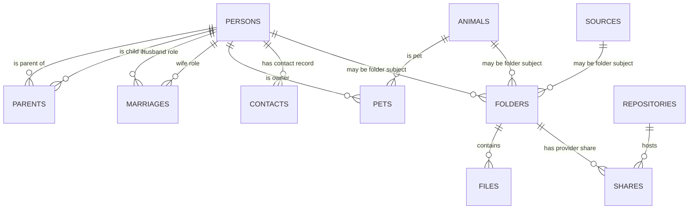

# FamilyTree database schema

## Purpose and scope

This document is a curated map of the Neon Postgres database used by Year End
and the family-tree work. It records database structure and application-facing
relationships, not family records, credentials, tokens, or database exports.

The inventory was verified against the primary `main` branch on 2026-08-15 via
the connected Neon Postgres integration. It is intentionally not a raw DDL
dump: migrations and database changes must update this document when they alter
an application-facing contract.

## Ownership and internal schemas

| Schema | Role | Documentation scope |
| --- | --- | --- |
| `public` | Core people, animals, and direct relationship records. | Documented here. |
| `tree` | Relationship-derived views used for family membership and tree traversal. | Documented here. |
| `project` | Year-in-Review folders, files, sources, shares, appearances, and summaries. | Documented here. |
| `config` | Media and Adobe/project reference data. | Documented at a domain level. |
| `ingestion` | Submission-source, browser, repository, album, and contact metadata. | Documented at a domain level. |
| `publishing` | Reviews and their music/publishing metadata. | Documented at a domain level. |
| `nello` | Project-level family configuration, currently including the configured founder. | Documented at a domain level. |
| `auth` | Application/session helper functions. | Internal; not a public data contract. |
| `neon_auth` | Neon-managed authentication synchronization. | Platform-managed; do not modify casually. |
| `_debugging` | Dependency/debugging views. | Internal tooling. |

## Core relationship model

`tree` views derive family-specific membership and relationship structures from
the core records. A person being present in `public.persons` does not by itself
mean they should appear in a family-tree presentation; tree-facing code should
use the appropriate `tree` view/membership rules.

## `public`: people and direct relationships

### Maintainer notes

Free-form `notes` columns in family/core data are maintenance annotations: they
explain historical decisions, anomalies, or follow-up work to the project
maintainer. They are not business data. Application queries, derived views,
automation, and family-facing outputs must not rely on or display them; the
only permitted exposure is an intentionally private `_debugging` or maintenance
surface.

### `persons`

Core person identity record.

| Column group | Fields |
| --- | --- |
| Identity | `person_id` (UUID primary key), `prefix`, `first_name`, `middle_names`, `last_name`, `suffix`, `nick_name` |
| Personal data | `sex`, `birth_date`, `birth_date_precision`, `death_date`, `death_date_precision`, `notes` |

Current database checks constrain birth precision to `day`, `month`, `year`,
`past`, or `future`; death precision to `day`, `month`, `year`, or `past`; and
the existing `sex` field to `m` or `f`. These are current physical constraints,
not an endorsement of their suitability for future family modeling.

### `parents`

Relationship table with `child_id`, `parent_id`, and `relation_type`. Current
relation types are `biological`, `adoptive`, and `step`; the default is
`biological`.

### `marriages`

Marriage record with `marriage_id`, `husband_id`, `wife_id`, `wedding_date`,
and `wedding_date_precision`. The current schema encodes spouse roles in column
names and has a primary key on `marriage_id`.

This is a known database-modernization candidate. A future participant/junction
model may represent spouses, same-sex marriages, divorce, remarriage, and
relationship history more directly. Do not alter it without a migration plan
for the `tree.marrieds` view and every dependent consumer.

### `animals` and `pets`

`animals` holds animal identity records. `pets` connects `pet_id` to `owner_id`
and stores `relation_type`, `gotcha_date`, and date precision. Current pet
relation types are `adoptive` and `shared`.

### Other `public` objects

- `friendships` records person-to-person friendship relationships.
- `display_names` is the display-facing view used by dashboards and profile
  image workflows.
- `founder_id`, `generation_to_text`, and `suffix_to_text` are helper
  functions used by the relationship/display layer.

## `tree`: derived family structure

`tree` contains views rather than separate, disconnected copies of family data:

- `members`: family/tree membership attributes, dates, member type, and related
  data used by `family_tree.ancestry`.
- `marrieds`: spouse-pair projection used by relationship traversal.
- `households` and `clans`: current and birth/household grouping for display and
  representation logic.
- `heads`, `apexes`, and `nodes`: derived structural views used by tree layout
  and relationship calculations.

These views are part of the effective application contract. Before changing
core relationship tables, inspect their definitions and consumers.

## `project`: media and Year-in-Review state

### `folders`

Represents a project-year media folder.

| Column group | Fields |
| --- | --- |
| Identity | `folder_id` (UUID primary key), `folder_name`, `project_year`, `media_type` |
| Optional subject/source links | `person_id`, `animal_id`, `source_id`, `member_id` |

The database allows at most one non-null value among `person_id`, `animal_id`,
and `source_id`. `(project_year, media_type, folder_name)` is unique with nulls
treated as equal. `media_type` references `config.media`.

### `files`

Represents a discovered media file within a project folder.

| Column group | Fields |
| --- | --- |
| Identity/location | `file_id`, `folder_id`, `file_name`, `subfolder_name`, `base_name`, `file_extension` |
| File/editorial metadata | `file_size`, `video_date`, `video_duration`, `video_resolution`, `video_rating`, `used_status` |

`folder_id` references `project.folders` with cascade deletion. The unique file
identity is `(folder_id, file_name, subfolder_name)`, with nulls treated as
equal. Ratings are constrained to 0 through 5.

### Supporting tables and views

- `sources`: named non-person/animal submission sources.
- `shares`: maps a folder to an `ingestion.repositories` provider record and a
  share URL; it is the likely persistence point for the future OneDrive sharing
  link workflow.
- `appearances` and `chapters`: Premiere-derived editorial output.
- `duplicates` and `duplicates_summary`: duplicate-detection views.
- `folders_summary` and `years_summary`: dashboard-facing aggregate views.
- `appearance_spans`: timeline-facing appearance view.

## `ingestion`: submission and contact metadata

- `repositories`: storage/provider repositories.
- `contacts`: optional `person_id`, `email_address`, and `repository_ids` JSONB
  data. It currently references `public.persons`.
- `shared_albums` and `shared_album_details`: shared-source data used by the
  Selenium ingestion workflow.
- `scrape_sources`, `browsers`, and `browser_profiles`: local scraping
  configuration.

The contact model is intentionally small today. Future email, address, phone,
and family-reference work should be designed as a coherent contact model rather
than accumulating unrelated fields without relationship rules.

## `config`: reference and workflow settings

- `media`: configured media types and source-folder mapping.
- `compilations`: review/Premiere compilation settings.
- `member_labels`, `adobe_labels`, and `color_palette`: label and color
  configuration used by the Adobe workflow.

## `publishing` and `nello`

- `publishing.reviews`: year/decade review identity and publishing metadata,
  including theme, duration, resolution, cloud URL, and public date.
- `publishing.music`: music associated with reviews.
- `nello.founder`: configured root/founder for family-tree traversal.

## Application consumers

| Consumer | Primary database surface |
| --- | --- |
| `repositories/inspect.py`, `repositories/migrate.py` | `project` tables/views and `config.media` |
| `repositories/assemble.py`, `compile.py` | `project`, `config`, and `publishing` |
| `scraping/`, `repositories/ingest.py` | `ingestion` source and album views |
| Streamlit `pages/` | `project` summary/appearance views, `tree` views, `public.display_names`, and `config` enums |
| `family_tree/` | `public` relationship tables plus `tree` membership/household/spouse views |
| Future onboarding/reference API | `public`, `tree`, and an evolved contact model; must use scoped access controls |

## Documentation and migration rules

1. Treat primary keys, foreign keys, unique constraints, check constraints, and
   application-facing views as contracts.
2. Before a schema migration, document affected views, Python consumers, data
   backfill, validation query, rollback path, and privacy impact.
3. Update this document with the final schema decision—not speculative design—
   in the same change as an application-facing migration.
4. Do not document values from private family records in this repository.

## Questions for review

- What is the intended distinction among `person_id`, `animal_id`, `source_id`,
  and `member_id` on `project.folders`?
- Which `tree` views should be considered stable interfaces versus work in
  progress?
- What are the intended semantics and lifecycle of `ingestion.contacts` and its
  `repository_ids` JSONB column?
- Are `project.shares` URLs intended to be canonical provider links, upload
  links, or both? What uniqueness/lifecycle rule should they follow?
- Which relationship events beyond marriage should the future model capture,
  such as separation/divorce, remarriage, and partnership dates?
