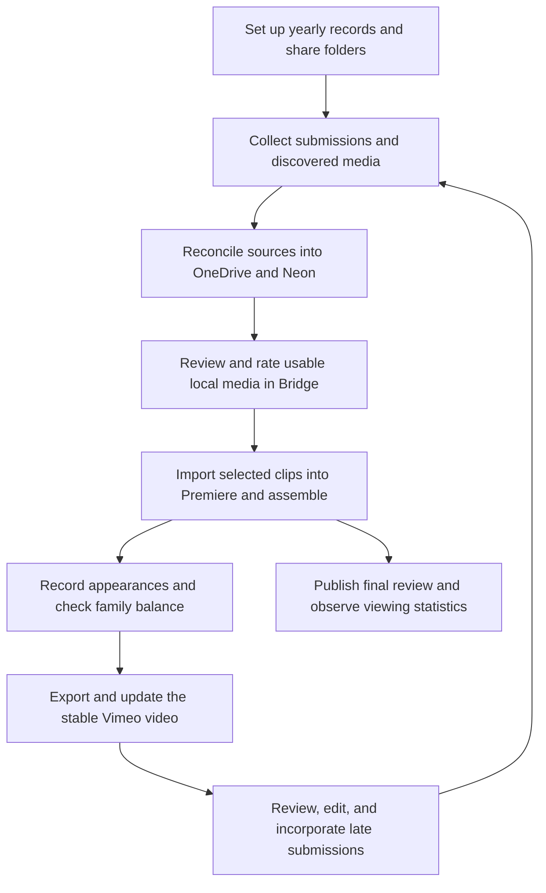

# Year End operational workflow

## Purpose

This document describes how the annual Year in Review (YIR) is made in
practice: the human work, recurring decisions, source handoffs, and supporting
systems. It complements the [architecture guide](ARCHITECTURE.md), which
describes the code and technical boundaries, and the [roadmap](ROADMAP.md),
which describes planned change.

The process has a project-editor role. It is currently performed by the
project owner, but the workflow is deliberately described by role so it can be
understood and repeated without tying it to one person.

## Participants and responsibilities

| Participant or system | Responsibility |
| --- | --- |
| Family and other contributors | Capture moments throughout the year and submit media using the sharing method available to them. |
| Project editor | Establish the yearly project, create and share folders, collect/reconcile media, review clips, assemble the video, and publish drafts/final output. |
| DJ or music collaborator | Produces the annual mashup used as the review soundtrack. |
| Neon | Authoritative record for people, relationships, project folders/files, editorial status, and appearance data. |
| OneDrive | Canonical working media library and participant-facing folder destination. |
| Google Drive, email, Google Photos, iCloud, and external sites | Intake sources that may require migration, download, browser collection, or manual review. |
| Adobe Bridge and Premiere | Local-only review, rating, project assembly, editing, and export tools. |
| Vimeo | Stable publication destination for iterative drafts and the finished review, plus subsequent viewing statistics. |

## The yearly cycle



This is intentionally iterative rather than a one-way production pipeline.
People continue submitting material while the editor is reviewing, assembling,
and revising. A late submission may re-enter at collection, reconciliation, or
review; it should not require rebuilding the workflow from scratch.

## Workflow stages

### 1. Maintain the family record and start the year

Before and during a project, the project editor keeps relevant people,
relationships, household membership, profile images, and contact/sharing
information current. Births, adoptions, marriages, and other changes can alter
both the family-tree presentation and the fairness checks used in the YIR.

Tree and editorial scope are dynamic: the configured founder anchors the family
relationship traversal, and people outside that relationship may be included
when their actual project appearances warrant it. This should not require a
permanent label such as "friend" or "contributor" on every person.

For a new year, create the project records and required OneDrive/Google Drive
folders, obtain their provider sharing links, and send those links to the
appropriate participants. The annual kickoff and follow-up messages should be
drafted and reviewed before group delivery.

Folder creation and reminders need a separate yearly participant plan. A prior
year's folders and contributors are useful candidates for that plan, not an
automatic template: a guest contributor who participated once should not
receive a new folder or reminder until the project editor intentionally includes
them for the new year.

The planned administrative GUI should present the prior year's submitters as a
starting list, allow the editor to uncheck anyone not expected to contribute,
and allow inclusion of appropriate people from the database who were not
previously selected. Family relationship alone does not imply that a person
should receive a folder in every project.

The current presentation convention for a new participant folder is `YIR Clips / [Year] / [Person Name] [Year]`. Repeating the year makes the folder clear to contributors who see it outside its parent tree and avoids confusion with a prior-year folder. This is a convention, not an identity rule: historical folders may use names alone, nicknames, or a media/event year different from the project year. The database's `project_year` and `member_id` relationship is authoritative.

Cloud folder reconciliation is year-scoped and inspects only immediate children
of each configured media/year folder. A dry run discovers provider IDs without
changing permissions or the database. Applying the operation always stores the
provider location. For the current calendar year it ensures an anyone-with-link
view permission and stores the share URL; for prior years it records only a
share permission that already exists and never creates a missing one:

```powershell
python main.py --onedrive-shares --year 2026 --dry-run
python main.py --onedrive-shares --year 2026 --apply
python main.py --google-drive-shares --year 2026 --dry-run
```

Google Drive reconciliation does not require a locally mounted Google Drive.
Provider project roots use the existing `local_storage` folder names in
`config/drives.toml`; for OneDrive this resolves to
`Videos / YIR Clips / [Project Year]`.

### 2. Collect media from where contributors already are

Contributors use different paths. The project should accommodate those paths,
then normalize media into the canonical working library:

| Source | Usual handling |
| --- | --- |
| OneDrive | Preferred route; inspect the shared folder and reconcile into the project library. |
| Google Drive | Inspect and migrate to OneDrive when appropriate. |
| Email | Identify relevant attachments or file-sharing links, review them, then download into ingestion. |
| Google Photos | Collect shared material through the trusted local browser workflow. |
| iCloud Photos | Collect material through the trusted local browser workflow for participants who cannot practically share files themselves. |
| Text messages | Generally discouraged when the delivery path degrades source quality. |
| YouTube, news, and other websites | Manually identify potentially relevant appearances; review rights, suitability, and technical access before ingestion. |

The system should retain source and contributor context during ingestion. The
collection goal is not to force every contributor onto one platform, but to
bring accepted material into a consistent, auditable OneDrive/Neon workflow.

### 3. Reconcile, inspect, and review media

The editor reconciles the selected source material into OneDrive, detects likely
duplicates, and records folders/files and available metadata in Neon. Local
inspection can then obtain metadata that provider APIs cannot reliably supply.

The editor watches each candidate clip and assigns an editorial rating in Adobe
Bridge. Corrupt, unsupported, duplicate, poor-quality, or otherwise unsuitable
files must be visible as such rather than silently treated as usable.

### 4. Prepare music, captions, and the Premiere project

The DJ/musical collaborator produces the annual mashup. Once available, the
editor brings the audio into the project. Lyrics are turned into an SRT caption
file so closed captions can be included in the finished review.

The editor creates/prepares the Premiere project and imports the clips that
have earned a suitable review rating. Premiere operations remain local because
they rely on installed Adobe applications and local media.

### 5. Assemble and balance the review

The editor assembles the review, then records who appears in each selected
segment. Appearance data and the family relationship structure support checks
that individuals and sub-family units receive reasonably balanced visibility.
The editor makes the final creative decision: fair representation is a guide,
not a mechanical substitute for editorial judgment.

People who are merely contributors, friends, or external subjects must not
appear in the family-tree display or balance calculations unless they are
intentionally included by the family-data rules.

### 6. Publish, revise, and close the cycle

The editor exports a first draft and uploads it to Vimeo. The Vimeo video link
is intentionally stable while later exports replace/update the video, so
viewers do not need a new link for every revision.

When the review is complete, the editor sends the final announcement, subject
to approval for group communication. Viewing statistics can continue to grow
after publication and are a publishing outcome, not a signal that the yearly
workflow has stopped being historically relevant.

## Manual decisions and automation boundaries

Automation should reduce clerical work, not make private or editorial decisions
without context. In particular:

- Folder creation, link discovery, inventory, metadata collection, duplicate
  candidates, and status summaries are good automation candidates.
- Source ingestion should preserve a review step unless a contributor/source is
  explicitly trusted for automatic collection.
- Clip ratings, final creative selection, representation tradeoffs, and rights
  review remain human decisions.
- Group communications are drafted for approval; routine individual operational
  notices may be automated only after their trigger and wording are agreed.
- Browser-profile-based Google Photos and iCloud collection remain trusted
  local operations. Cloud orchestration may track or queue them, but must not
  copy personal browser profiles or credentials into a hosted runner.

## Maintenance expectations

This is a living process document. Update it when a recurring handoff changes,
a new contributor route becomes supported, or automation shifts a manual step's
ownership. Keep implementation-specific detail in the architecture guide and
future feature decisions in the roadmap.
